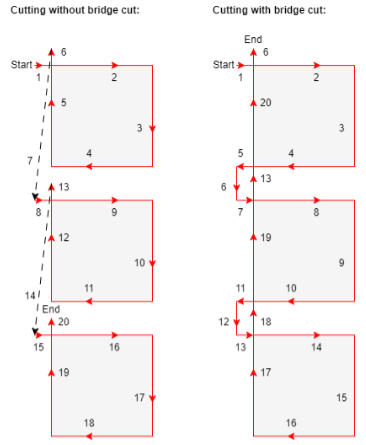
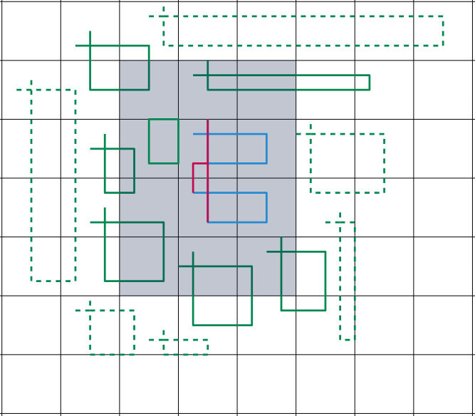

# Digisteel optimized

The first project for my forth year HBO I got an assignment for optimizing a steel cutting machine, this being the [v320](https://www.voortman.net/en/products/v320-cnc-plate-cutting-drilling-machine) from voortman. This machine cuts steel plates using plasma, hereby the cuthead can move from from back to front while for horizontal montions the whole steel plate is moved, this was an importent limitation we had to keep in mind.

## The problem

The problem we had to solve was that the machine was not vast enough. The machine already was able to choose optimal places for the parts and cut them out in an optimal order as to spend as little time as possible simply moving to the next piece without actually cutting anything. The process per part currently was that the head would move to a startposition, where it would burn through the material for a while before cutting the shape out, after which the plate under the piece would drop making room for the piece to fall out and be collected.

[](https://www.youtube.com/watch?v=F-or78T_Ngo)

## The solution

The solution for this problem was to combine pieces together, as the biggest time waster currently in the process was the burn through process. So for our application we wanted to create a parser that would take all the pieces on the sheet and where possible combine the paths to make it so the pieces would be cut imidiatly after one another, instead of waiting for the burnthough and the bed to drop. The one issue with this is that the sheet was not allowed to move if a piece was laying loose on the bed, due to this the final cut had to be as verticle as possible, although we also wanted to add a config file which could be edited to overwrite this feature.



## Extras

During this project we ended up doing a few things extra. I for one really wanted to visually show the results of the application, which was not really possible at first as the in and output was a ```json``` file which was not really showing us much at first. This application would show what the application does and would also keep track of specific data, this mostly being the time it would take to cut all the pieces and how much time was wasted doing things we would preverably avoid. This application also formed the first basis for the actual application, as some of the code could be reused without issue.

Besides this we also introduced a number of optimalizations to speed the process up as much as possible. The wanted results being far better than what was originally asked of use as the application had to parse about a thousend pieces in a few minutes time, we ended up reaching a speed of about twothousend pieces parsed in about a second. Making the application essentially seemless in the existing process.



## Conclusion

The application formed a good basis of what could be possible with combining elements on a sheet to speedup the process of cutting, as the ideal optimalization would yield a 200% speed increase. While the average would yield about a 120% increase. The applications that we made are owned by Windesheim however, since we made it for a studie project. Due to this the application we made can't be used for the product, but what they can and will do is create their own application that takes notes from out application and the design documents we provided. It is that code that'll be sold with the machines.

[](https://www.youtube.com/watch?v=s01eEabLAsM)