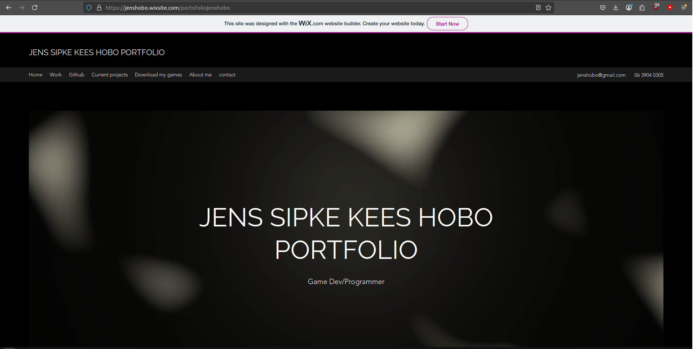

# Portfolio pages

Generally I see myself as an embedded software engineer, meaning I create software for small embedded computers, usually in C or C++, not this entree though.

## Too many pages

Over the years since I joined HBO I have been making changes to my own portfolio site in order to get it to look just the way I like it, without making it seem to complicated. But please do note that I am not at my best when making and designing websites. Regardless I have created a few.

## 2019, it did the job

For my first portfolio site I ended up using Wix, as I had no idea how to do anything like it myself, the site is pretty basic, it got the job done as it helped me get my first internship in IT. You can still visit this site to this date, just don't expect too much. [Here](https://jenshobo.wixsite.com/portofoliojenshobo) is the link to it.

## 2022, been a while

After starting my HBO studio is 2021 I rediscoverd my old portfolio site and quick note, I didn't like the fact I used Wix, seeing as at that point, I was well into the role of a software engineer. So I desided to create my own site using GitHub pages, which only hosts the site, and create everything else myself using html. The result was a site that looks a lot like my old Wix site, but a lot more basic. Never the less, I was happy with it.

## 2022, just later in the year

The site just felt a little to basic, so I ended up revisiting this project again, this time to make it a lot more dynamic, which is easier said than done. It had moving items and dynamic menu, the only problem, it wasn't easy to navigate, this would be my most shortlived version as the feedback I got was less than stellar, all to do with the useability.

## 2023, getting to the real deel

For this revision I made the desission to make it more basic again, but add some light touches here and there. The idea for the blurred backgrounds came into play, and if you haven't notices yet, they all move slightly. It was this version I ended up keeping and instead of starting from stratch again, I would just add more onto it. Most noteably the use of markdown files for all the contect, rather than manually writting everything into html, this sped up the process of writting content a lot.

## 2025, why am I doing this?

The sites I have made up until this point where all for myself, the one person that needed to be happy about the design (and I am not a designer) was myself. This time however, it would be a little different, as my sister wanted to enter an art school, she needed a portfolio to show she had what it takes to enter the school. The site that came out of it was made and designed by me, but with lots of input from my sister of course, you can see it live [here](https://lykehobo.github.io/). The site needed to resemble a file system that you can navigate and search, so this I did.