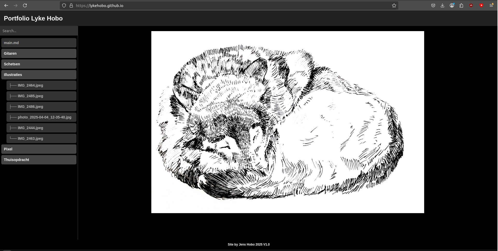

# Portfolio pages

Generally I see myself as an embedded software engineer, meaning I create software for small embedded computers, usually in C or C++, not this entree though.

## Version 0

For my MBO study we where required to start an internship, for this it was advised we make a portfolio website. Back then my only knowledge with programming was C# and Unity since I followed the game development study. The result of this was that I had no clue on how or where to create a website, due to this the first site I made was using Wix, it is still only and if you must you can find it [Here](https://jenshobo.wixsite.com/portofoliojenshobo). However, due to this site being made with Wix, no programming was required to build it. Seeing as I wanted to follow a HBO study, I ended up seeing this as more of a version 0 of my site.

## Version 1

For my first official site while in my first year of HBO I wanted to create something myself, I had up to that point learned about PHP, HTML and CSS (I wasn't that great with it though). I never hosted my own server back then so for simplisity sake, and due to the fact I had been using GitHub for a while at that point, I created my site through [GitHub Pages](https://docs.github.com/en/pages/getting-started-with-github-pages/creating-a-github-pages-site).

The site itself ended up being quite basic, the overall style looked a bit like my old Wix site but simplified. As I am not a graphic designer I had no clue on wether the site was appealing, rather I judged it bassed on my own preferances and on the eash of use for both the visitor as well as myself.

## Version 2

At some point I discovered how to create proper 2D animations with CSS, this let me down a rabbit hole of redesigning my whole site using these methodes. The site had dynamic backgrounds of old projects of mine, slide out menu's and transition effects. This site however ended up being my shortest lived on to date as the site became complicated to use while updating the site with new entrees didn't become easier. I did keep the site around for a short while, while I prepared version 3.

## Version 3

The third (and current) version of my site returned back to what my version 1 site was, simple and straight to the point. However I did allow myself some fun effects that wouldn't take away from the overall use of the site. This being the background, now a simple image with a blur and zoom effect, and the transition effect. This version would be the one I ended up keeping the longest throughout my study and the one I used when applying for projects.

## Version 3.1

While I was following along with the study I ended up really prefering doing my documentation via markdown files, as these are simple to create and maintain. during a guest class I was told about a library that would allow you to use markdown in HTML, I thought this would make my days a lot easier writting new pages (as I have been putting it off for quite a while). So for version 3.1 (sticking on 3 as I am not rebuilding the whole site from scratch this time) I wanted to finally create a system that would make the maintainer experience better. For this I implemented a system that would open a dynamic page and load in the markdown file requested (you can see this currently working in the URL above). Due to me using GitHub Pages I was not able to create this serverside, as this doesn't allow the use of PHP, all of it had to be done using JavaScript. Believe me when I say this, JavaScript is not fun to use, but I did it anyway.

Any version after this just made the system work a little better by adding things to the URL for a better time sharing pages externally (not that I think anyone but me ends up doing that). While I do have a shell script that'll parse markdown files into HTML, as of writting this I have yet to finish this and I would rather just create an application for it, maybe for a future project.

## Other sites

My sister needed a portfolio site for her application to an art school. I ended up creating a simple site that shows her images files using a folder structure system as per her request. I have plans to create a parsing application for her as well, although I have not yet done this as of writting this. You can find her site [here](https://lykehobo.github.io/).

