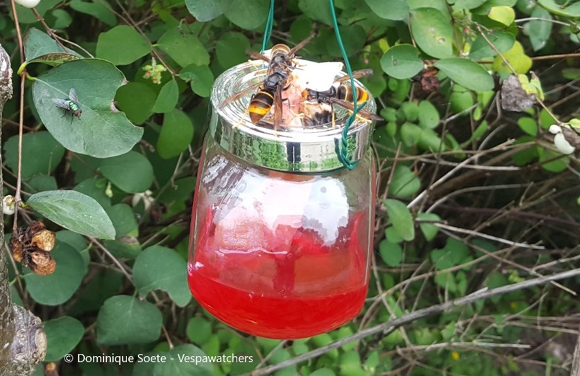

# Veluta Monitor

For my third year HBO I got an assignment from two beekeeper, one from Zwolle in the Netherlands, the place where I usually work, and one from Switzerland. Due to this the project was pretty much exclusively done in English as a means to use a language we could all understand, my german is not that great (as of 2024). The project was to create a methode for locating [asian hornets](https://en.wikipedia.org/wiki/Asian_hornet). as these have been spotted more and more in Europe and are causing all kinds of issues. One of which is eating european honey bees whom, unlike with the asian honey bee, don't have a defence methode for these hornets. As they never evolved with them.

## The current situation

Before the start of the project what would usually be done is labor intensive and/or expensive, as these methodes would usually boil down to catching a hornet in the field, placing something on it to track it, be it a bit of cloth to track it visually (which is labor intensive and prone to failure) or by using a small GPS tracker (which has simular issues allong with being expensive). Placing a lure near your beehive also usually wouldn't work as the hornet can't be killed since you can't find it's nest then, meaning more hornets are prone to show up without you knowing when and from where.

## The solution

What the solution we worked on was a modified lure. Instead of using a lure to capture and kill a hornet, we would simply release it again and wait for it to come back. As to the hornet's point of view, it found food, so it would go back to the hive to tell where it found food before going out and back again to get the rest. This is where we do our magic as the hornet would have been marked, meaning as it returns we can detect the same hornet as before and we have kept track of the time it took to return. This time is crussial as hornet have an avarage flying speed which you can calculate. Using this information we can calculate a distance and draw a circle around the lure of where the nest could be. If you combine this with three or so other lures doing the same thing, you get a map of three circles, which you can use to calculate the precise position of where the nest should be.

For demonstration perpous we created a demo video which does all of this digitally, this video was edited by me as I do sometimes for my personal hobby.

## The result

The result of this project is that we managed to add a great IOT solution to the existing project. For this project we participated in [Winnovation](https://hboict.samenwerkenmetwindesheim.nl/events/winnovation/). Here we ended up winning the green award for realising a project that is considered positive for the environment. For this we got an award which I myself designed, which is just fantastic. If you wish to read more about this particular event (and you know Dutch), you can find it [here](https://liveadminwindesheim.sharepoint.com/sites/Nieuws/SitePages/Sam,-Matz,-Jay-en-Jens-winnen-de-Green-Award-tijdens-Winnovation-2024!.aspx). We also managed to get into the local newspaper for this project, which you can find and read back [here](https://www.destentor.nl/zwolle/studenten-in-zwolle-bedenken-prijswinnende-oplossing-tegen-gevreesde-aziatische-hoornaar~a979432d/).

